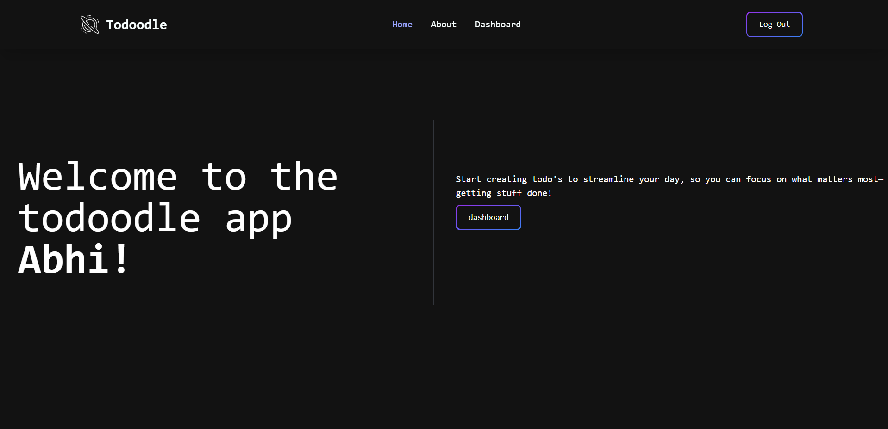

# Todoodle

Todoodle is a feature-rich to-do application built with Django. It allows users to create and manage their to-dos and associated tasks with a modern, responsive UI styled with Tailwind CSS. The project demonstrates advanced Django techniques including inline formsets, file uploads, and custom widget styling.



## Features

- **User Authentication:**
  Users can register, log in, and manage their own to-dos.

- **Todo Management:**
  Create, update, and delete to-dos with support for image uploads.

- **Task Management:**
  Add, update, and delete tasks within a to-do. Tasks can be marked as completed using a custom toggle button.

- **Responsive Design:**
  The UI is styled with Tailwind CSS for a modern, responsive experience.

## Installation

1. **Clone the repository:**

   ```bash
   git clone https://github.com/abhicodes07/Todoodle.git
   cd Todoodle

   ```

2. **Set up a virtual environment and activate it:**

   ```bash
   python -m venv env
   source env/bin/activate  # On Windows use `env\Scripts\activate`
   ```

3. **Install the required packages:**

   ```bash
   pip install -r requirements.txt
   ```

4. **Apply migrations:**

   ```bash
   python manage.py makemigrations
   python manage.py migrate
   ```

5. **Run the development server:**

   ```bash
   python manage.py runserver
   ```

6. **Access the application:**

   Open your browser and navigate to `http://127.0.0.1:8000/`.

## Usage

- **Dashboard:**
  After logging in, you'll be redirected to your dashboard where you can view, update, and delete your todos.

- **Create Todo:**
  Use the "Create Todo" form to add a new todo. You can also attach tasks to it.

- **Update Todo & Tasks:**
  Click on a todo to edit its details and manage its tasks. Tasks can be added or removed dynamically, and you can toggle their completion status.

## Contributing

Contributions are welcome! If you'd like to contribute:

- Fork the repository.
- Create a new branch for your feature or bug fix.
- Commit your changes with clear messages.
- Open a pull request and explain your changes.

Please follow the existing code style and add tests if possible.
